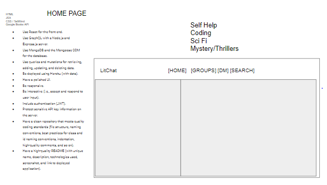
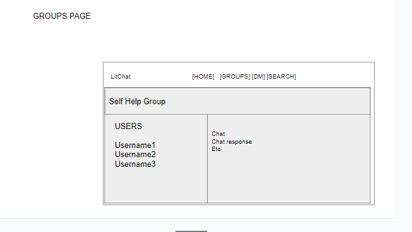
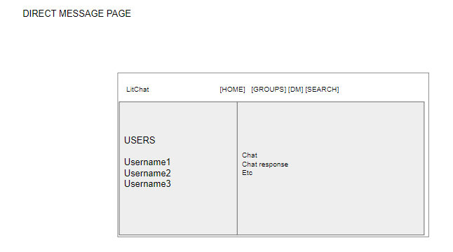
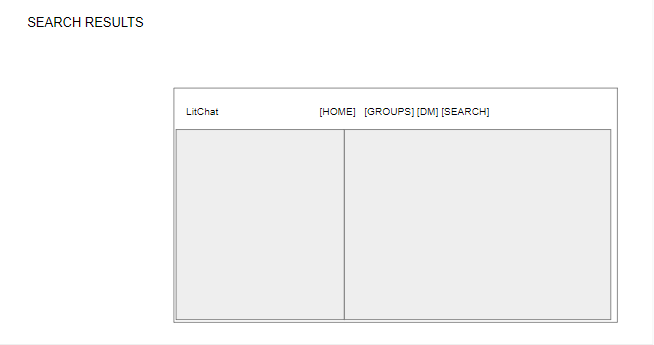

# Lit Chat

## Table of Contents

1.[Description and Purpose](#description)

2.[User Story](#userStory)

3.[Acceptance Criteria](#acceptanceCriteria)

4.[Wireframes and Mock-Ups](#mockups)

5.[Built With](#built-with)

6.[Usage](#usage)

7.[Contribution](#contribution)

8.[License](#license)

9.[Questions](#questions)

10.[Credits](#credits)

## Description

Lit Chat is a website where users can come together to discuss their ideas about their favorite literature

The application is intended to allows people to have a book club even if there aren't any folks in their area who enjoy the same books that they do.

## User Story

## Acceptance Criteria

## Wireframes and Mock-Ups

[]
[]
[]
[]

## Built With

- HTML
- CSS
- JavaScript
- Node.js
- Express.js

## Usage

View the deployed page at [Lit Chat]("heroku link here").

## Contribution

You can contribute to this application by opening a pull request at github.com/hasherlaws18/Chat-App. Currently there are no rules or standards for contribution.

## License

This application is licensed under the MIT license.

## Questions

Known erros and other issues can be raised to the repository on github at github.com/hasherlaws18/Chat-App , or can be sent to my github profile at github.com/hasherlaws18. As last resort, questions can be emailed to me directly at alanhornbaker@gmail.com.

## Credits

- [alanhornbaker](https://github.com/alanhornbaker)
- [hasherlaws18](https://github.com/hasherlaws18)
- [Matin Tavacoli](https://github.com/mtavacoli)
- [Danielle Leaton-Salinas](https://github.com/dleatonsalinas)

## Table of Contents

## Usage

Navigate to "heroku URL", create a profile, and start chatting!

## Contributing

Pull requests can be made to https://github.com/hasherlaws18/Chat-App.

## Questions

If you have any questions about the repo, please [open an issue](https://github.com/hasherlaws18/Chat-App/issues) or contact me via email at alanhornbaker@gmail.com. You can find more of my work on my GitHub, [hasherlaws18](https://github.com/hasherlaws18/).
